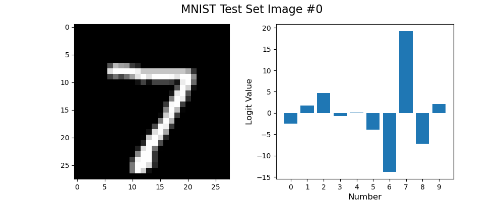

# MyTorch

MyTorch is a deep learning training framework with APIs similar to PyTorch.
I built MyTorch for fun and for learning more about autograd algorithms and CUDA operators development.
MyTorch is fully built from scratch except cublasLt usage for fast matrix multiplication.

## Features

- CUDA support for most important operators, such as Conv, BN, ReLU, Linear. CUDA support is in the first place of MyTorch development.
- Autograd system for `tensor.backward`.
- MyTorch includes various operators implementations, e.g., element-wise operators, reduction operators, broadcast operators, CNN operators.
- SGD optimizer.
- Module/optimizer state_dict save and loading through `mytorch.save` and `mytorch.load`.
- Data stuff: `DataLoader` and `Dataset`.

## Examples

### Linear Regression Example

[This example](mytorch/examples/linear_regression.py) shows how to use MyTorch to train a linear regression model and fit a noised line.

```bash
python -m mytorch.examples.linear_regression
```

### MNIST Example

[This example](mytorch/examples/mnist.py) shows how to use MyTorch to train MNIST.
The API usage is basically the same with PyTorch.
Users can easily get used to it with former PyTorch experience.



```bash
python -m mytorch.examples.mnist --save-ckpt ./ckpt.mt
# saving optimizer and model checkpoint to ckpt.mt after training 1 epoch
python -m mytorch.examples.mnist --ckpt ./ckpt.mt --save-ckpt ./ckpt.mt
# load ckpt.mt into model before training
python -m mytorch.examples.mnist --ckpt ./ckpt.mt --eval 0 1 2 3 4
# evaluate trained ckpt.mt with 5 images from MNIST test set
```

## Drawbacks

- Now MyTorch is slightly slower than PyTorch due to lack of finegrained optimization. In the aforementioned MNIST example, MyTorch (43s on a laptop RTX 4060) is around 26% slower than PyTorch (34s) when running 3 epochs.